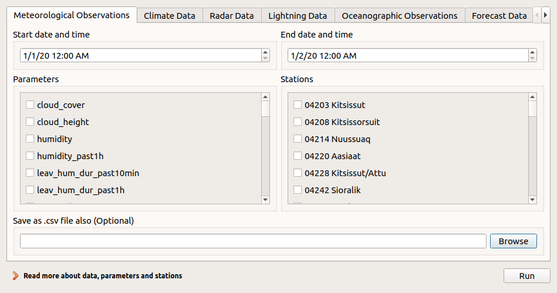

# DMI Open Data QGIS plugin

DMI has built a QGIS plugin for retrieving and loading DMIs Open Data sets onto the map through a user friendly interface. It does so by interacting with DMIs Open Data APIs on behalf of the user.



The main features on top of the API provided are:
 - Displaying options for stations and parameters to retrieve
 - Performing multiple API calls where needed and joining data into one map layer
 - CSV output option

## Getting started

~~The plugin is included in the official plugin repository, and be installed simply by going to Plugins -> Manage and install plugins -> All, and search for "DMI Open Data".~~

Another option is to download the latest zip file build [here](https://github.com/dmidk/Open-Data-QGIS-plugin/releases). Install it by going to Plugins -> Manage and install plugins -> Install from ZIP, and select the zip file you just downloaded.

## Development

Pull requests for new features, bug fixes etc. are very welcome.

### Setup

Clone this repository.

In order to run a local version of the plugin, you need to install the developer tools:
```bash
pip install -r requirements-dev.txt
```

When dependencies are installed, the plugin can be installed into QGIS through `pb_tool`, which was installed in the previous step:

```bash
pb_tool deploy
```

`pb_tool` will ask you about if it should proceed, where the answer is `y` (yes).

### Loading modififications into QGIS

If you wish to try out changes to the code in QGIS, please run `pb_tool deploy` and answer `y` to re-install the modified version of the plugin.

If QGIS is already running, you need to reload the plugin in QGIS itself. You can use [Plugin Reloader](https://plugins.qgis.org/plugins/plugin_reloader/) to do this. Simply install Plugin Reloader and press the reload symbol with the "DMI Open Data" plugin selected.

### Before making a Pull Request

Please make sure:
 - Unit tests run without failures (ie. `pytest test` should run without failures)
 - Relevant unit tests are written for the provided code